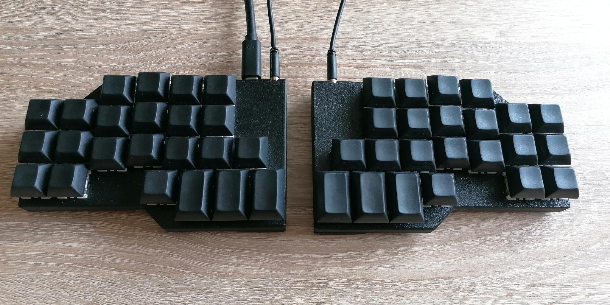
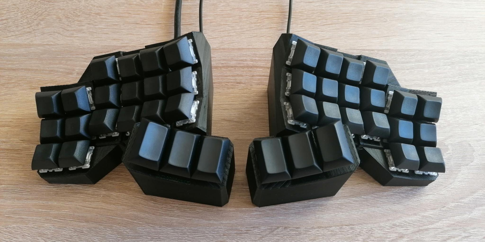
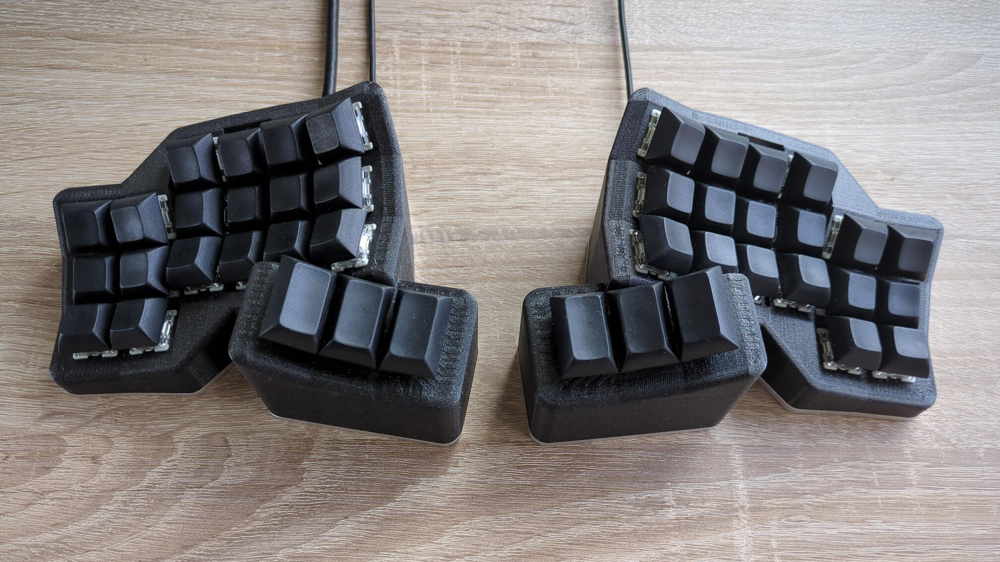

# Keyboards

This repository contains the code, cases and co. of the keyboards I have built.

All keyboards in chronological order:

| Name                        | Image                                                 | Description                                                                        |
| --------------------------- | ----------------------------------------------------- | ---------------------------------------------------------------------------------- |
| [Manuform](manuform/)       |           | 50% hand-wired keyboard focussed on ergonomic typing with ortholinear columns      |
| [Ergomin](ergomin/)         |              | 40% PCB based split keyboard focussed on ergonomic typing with ortholinear columns |
| [Concavum](concavum/)       |           | Fully parametric ergonomic split keyboard with automatically generated matrix PCB  |
| [Concavum v2](concavum-v2/) |  | Second revision of the Concavum keyboard with an easy to use customizer            |

## License

This project is licensed under the MIT license, see [`LICENSE.txt`](LICENSE.txt) for further information.
