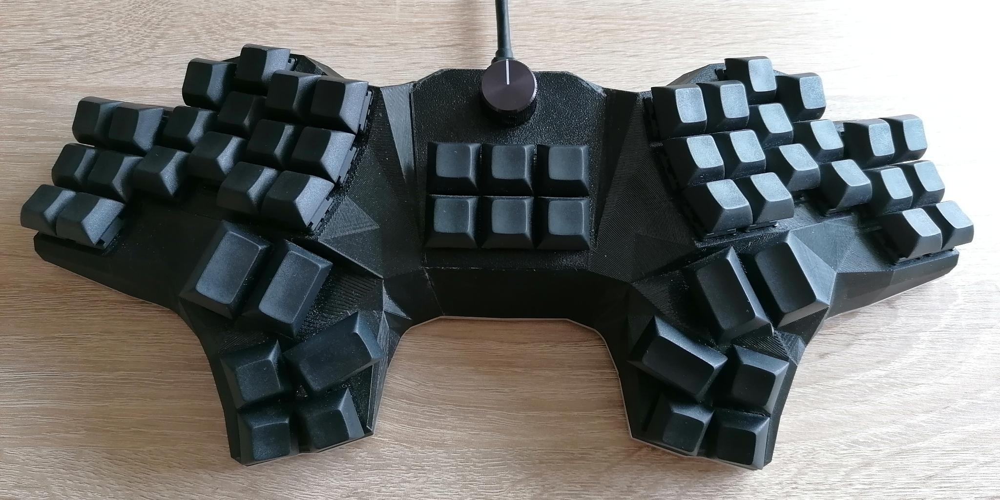

# Keyboards
This repository contains the code, cases and co. of the keyboards I have built.

All keyboards in chronological order: 
| Name                  | Image                                        | Description                                                                        |
| ---                   | ---                                          | ---                                                                                |
| [Manuform](manuform/) |  | 50% hand-wired keyboard focussed on ergonomic typing with ortholinear columns      |
| [Ergomin](ergomin/)   |     | 40% PCB based split keyboard focussed on ergonomic typing with ortholinear columns |

## License
This project is licensed under the MIT license, see [`LICENSE.txt`](LICENSE.txt) for further information.
