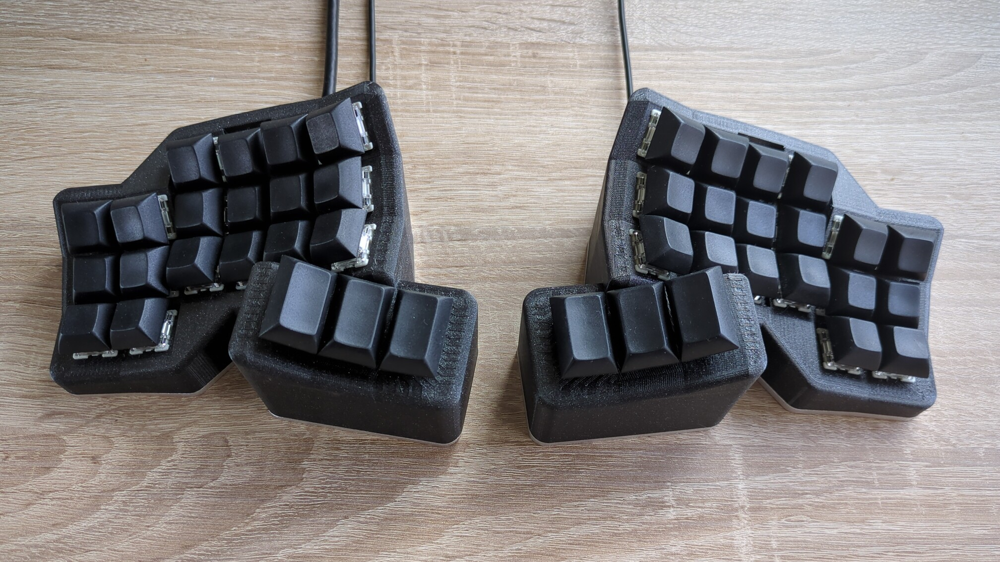

# Concavum v2



## Overview

The Concavum v2 is a fully parametric split keyboard featuring an ergonomic layout with ortholinear (non-staggered) columns and concave key wells.

The centerpiece of the Concavum v2 is its customizer: It allows for changing all kinds of parameters like the number of columns, rows and thumb keys, the curvature, the distance between keys and many more.
It generates 3D printing files for the case, a PCB for connecting the key switches and configuration files for the keyboard firmware.

## Building your own

First, use the [Concavum customizer](https://github.com/julianschuler/concavum-customizer) to configure your Concavum to your liking.

When you are finished with configuring the keyboard, use the export button at the top right of the configuration panel to export all model files.
Extract the exported ZIP archive to a folder and switch to it.

### Parts list

You can find a detailed parts list in the file `bom.csv` in the export.

### Case

The case of the Concavum is 3D printed, you can find the corresponding files in the `case` subfolder of the export.
Since both halves are symmetric, only the 3D printing files for the right half are included in the export.
Mirror the files along the X axis in your slicer to print the left half.

The cases of both halves should be printed in the default orientation and using support material.
For my build, I used [Prusament PETG Galaxy Black](https://www.prusa3d.com/product/prusament-petg-prusa-galaxy-black-1kg/).

The bottom plates may either be 3D printed or laser cut.
Currently, the customizer only exports a 3D printing file for the bottom plate.
You can use [OpenSCAD](https://openscad.org/) with the provided `bottom_plate_to_dxf.scad` script to generate a DXF file for laser cutting:

```sh
openscad -o bottom_plate.dxf bottom_plate_to_dxf.scad
```

For my build, I ordered the bottom plates to be laser cut out of 3mm thick aluminum sheet.

### PCBs

The Concavum uses two types of PCBs in each half.
The interface PCB houses the keyboard controller, a TRRS and FFC connector and is the same for all Concavum keyboards.
You can find the KiCAD files of the interface PCB in the [`interface-pcb`](interface-pcb) subfolder of this repository.

The matrix PCB is generated by the customizer and specific to each keyboard.
It connects all keys in a matrix and connects to the interface PCB using an FFC cable.

For manufacturing, some break-away tabs should be added to the matrix PCB.
You can generate these tabs using [KiKit](https://yaqwsx.github.io/KiKit/latest/).
Start by [installing the KiKit backend](https://yaqwsx.github.io/KiKit/latest/installation/intro/) and execute the following command in the `pcb` folder of the exported files:

```sh
kikit panelize -p kikit_parameters.json matrix_pcb.kicad_pcb matrix_pcb_panelized.kicad_pcb
```

> **Tip:** You can also use KiKit to generate the gerber files from the KiCad files:
> ```sh
> kikit export gerber matrix_pcb_panelized.kicad_pcb matrix_pcb
> kikit export gerber interface_pcb.kicad_pcb interface_pcb
> ```

The two PCB types require different thicknesses.
When ordering, select 0.6mm for the matrix PCB and 1.6mm for the interface PCB.
You need at least 2 boards of each type, one of each type per half.

### Assembly

First, install the heat set inserts into the provided holes.
Add the key switches to the case, making sure that the orientation of the pins is aligned with the holes in the matrix PCB.

Next, assemble the interface and matrix PCBs.
All PCBs are designed to be assembled from only one side.
Lay down two pairs of interface and matrix PCBs with different sides facing up in each pair.
Solder all components on the top facing sides of each PCB, leaving the respective bottom sides unpopulated.
The assembled PCBs should be symmetric to each other.

Afterwords, carefully break off the tabs of the matrix PCBs.
Insert the matrix PCBs into the cases such that the sides with the diodes and FFC connector face outwards.
For each half, solder the matrix PCB to all keys, pushing it against each key while soldering.
Start with the home row and work your way up and down the columns and to the thumb cluster.

Finally, connect the interface and matrix PCBs of each half using the FFC cables and insert the interface PCBs into their dedicated holders.

Use a chamfer bit to create countersinks in the bottom plate holes to make the screws sit flush with them.
Screw on the bottom plate and attach the rubber feet to finish the build.

## Firmware

### Setting up QMK

The firmware is powered by QMK, [install QMK](https://docs.qmk.fm/#/newbs_getting_started) if not already done.

After the installation, rename the `qmk` folder of the export to `concavum` and move it to the `keyboards` folder in the QMK home.

You should now be able to compile the keyboard firmware using the following:

```sh
qmk compile -kb concavum -km default
```

Make sure to have a look at the excellent [QMK documentation](https://docs.qmk.fm/#/newbs_building_firmware) on how to create your own keymap.

### Flashing

To flash the firmware to the Concavum, connect the left half via USB and put the KB2040 into DFU mode by holding the boot button and tapping the reset button.
The KB2040 should now show up as a flash drive.

Mount the drive and flash the default firmware using the following:

```sh
qmk flash -kb concavum
```

Repeat the same process for the right half.

### Reflashing

To for example update the keymap, the firmware has to be reflashed. In most cases just reflashing the left half is sufficient.

If QMK is already flashed to the keyboard, it can also be put into DFU mode using a key with the `QK_BOOT` keycode or by double tapping the reset button on the KB2040.

It is highly recommended to add a `QK_BOOT` keycode your keymap since the physical reset button is only accessible with the bottom plate removed.

## License

This project is licensed under the MIT license, see [`LICENSE.txt`](../LICENSE.txt) for further information.
