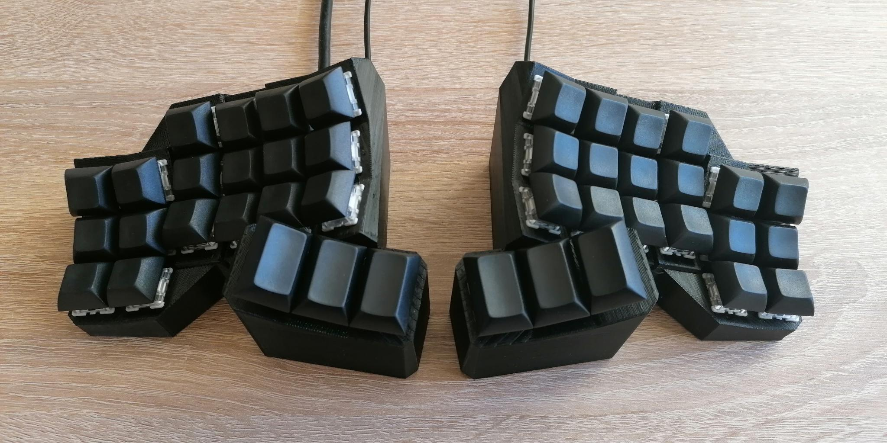
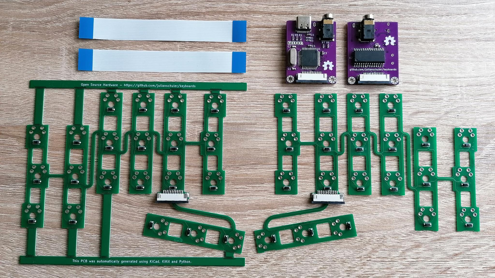
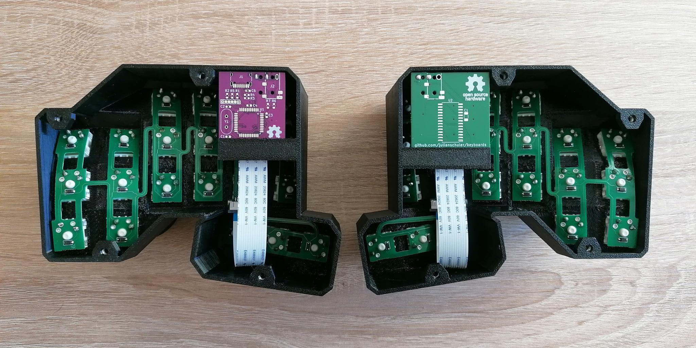

# Concavum

## Overview
The Concavum is a fully parametric split keyboard featuring an ergonomic layout with ortholinear (non-staggered) columns and concave key wells.

It can be adjusted to have 1-5 rows, 2-6 columns and 1-6 thumb keys per half and provides a script to automatically generate a PCB for the key matrix, so no hand-wiring is required.

Each half has thus 2 PCBs: The automatically generated matrix PCB, which is dependent on key count, offsets, etc., and a generic interface PCB which can be used for all sizes. Both PCBs are connected internally using a FPC cable, the halves are connected externally through a TRRS cable.

## Building the keyboard
### Parts list (excluding the PCBs and complementary components)
The amount of switches and keycaps depends on the number of rows, columns and thumb keys.
* 6-72x keyboard switches (Cherry MX, Gateron, etc.)
* 2-60x DSA keycaps 1U
* 2-12x DSA keycaps 1.5U
* 8x countersunk screws M3x8
* 8x nuts M3
* 8x rubber feet
* 1x TRRS to TRRS cable 30cm (make sure it is the 4-pole variant)
* ~150-350g of PETG filament for the 3D printed case (heavily dependent on the size)

### Adjusting the keyboard
The first step in building a Concavum is to adjust the keyboard to your hand.
Start by installing [OpenSCAD](https://openscad.org/downloads.html) if not already done.
Open the file `case/concavum-case.scad` in OpenSCAD and switch to the Customizer (`Window > Customizer`). Select the preset with the name `keyboard-paramters` in the first drop down menu (the preview should now show a cluster with 6 columns and 3 rows).

Now you can start adjusting the keyboard to your needs, the default values adjusted to my hands should provide a good starting point. Always save your changes to the preset `keyboard-parameters` as the values of this preset will be used for the automatic matrix PCB generation later.

### Printing and testing the case
When you are done with your modifications, render the Case using `F6` and export it as STL or AMF.
Support material is required for printing. However, use support blockers for the nut holders as it is nearly impossible to remove support material from their inside. You can find example print files under [`case/example-print-files`](case/example-print-files) which should give an idea on how to adjust the support material and print settings.

It is highly recommended to print only one half for now, adding the switches and keycaps and testing the feel first. It may take a few iterations, really take your time to find a configuration that fits your hands!

If you are happy with your configuration, you can now print the second half and add the remaining switches and keycaps.

The bottom plate of the keyboard can either be 3D printed as well or e.g. cut out of aluminum. It can thus be either exported as a 3D object or outline using
```
python3 case/export-bottom-plate.py [output file name]
```
where the file extension determines its type (e.g. `bottom-plate.amf` or `bottom-plate.dxf`). In case of cutting, chamfer the holes afterwards using a countersink drill bit to allow the screw heads to sit flush later.

### Generating the PCB
To generate the matrix PCB, install [KiCad 6.0](https://www.kicad.org/download/) and [Python 3](https://www.python.org/downloads/). Afterwards, switch to the `pcb` subfolder and install the Python dependencies by executing
```
python3 -m pip3 install -r requirements.txt
```
You can now generate the matrix PCB using
```
python3 generate-matrix-pcb.py
```
and afterwards export the gerber files for both the matrix and interface PCBs using

```
python3 export-compressed-gerber.py
```

When exporting the gerber files, a DRC is performed. If there is no output, everything worked as expected. If you still would like to inspect the generated matrix PCB, you can open the PCB file using PcbNew (the PCB editor of KiCad):
```
pcbnew matrix-pcb/matrix-pcb-panel.kicad_pcb
```

#### Ordering the PCBs and complementary components
After exporting, you will find two zip files in the `gerber` subfolder: One for the interface PCB and one for the generated matrix PCB.

The two PCB types require different thicknesses: 0.6mm for the matrix PCB and 1.6mm for the interface PCB.
You need at least 2 boards of each type (one type of board for each half).

> **Note:** For the matrix PCB, your PCB manufacturer has to support track widths and minimum clearances of 0.15mm each. In the special case of keyboards with the maximum number of rows, tracks and minimum clearances of 0.13mm each have to be supported.

### Assembly
First, insert the M3 nuts into their holders (you may need to remove a few keys if you have already assembled those during testing).
Afterwards, add the key switches while ensuring that the orientation of the pins is aligned with the holes of the matrix PCB.

To assemble the PCBs, take two interface and two matrix PCBs and lay them each down with different sides facing up. Now you can solder the complementary SMD components onto all four PCBs.
**Important: Only solder the SMD components to the top of each PCB! Otherwise the keyboard will not work!**


*Assembled PCBs and FPC connectors needed for the whole keyboard, with the rails and tabs still connected for the left matrix PCB. The interface PCBs shown are from the deprecated ATmega32u4 variant.*

Afterwards, you can carefully break off the rails and tabs of the matrix PCBs, ideally over an edge. You can now fit the matrix PCBs into the cases, the sides with the diodes and FPC connector facing outwards.
The matrix PCB has to be bend during this procedure. Therefore, start to solder the switches at the top row and work your way down to the bottom rows and the thumb cluster.

Finally, you can add the FPC cables to connect the interface and matrix PCBs of each half and slide the interface PCBs into their dedicated holders.


*Fully assembled keyboard without bottom plates, on the left a half with the (now deprecated) ATmega32u4 variant is shown, on the right the KB2040 variant can be seen.*

The keyboard can now be closed up by screwing on the bottom plate and attaching the rubber feet.

## Building the firmware
### Setting up QMK
The firmware is powered by QMK, [install QMK](https://docs.qmk.fm/#/newbs_getting_started) if not already done.
After the installation, it is necessary to add a symlink to the `qmk` subfolder of this repository to the QMK `keyboards` directory, for linux e.g by
```
ln -s /path/to/concavum/qmk /path/to/qmk/keyboards/concavum
```

Now you should be able to compile the keyboard firmware by executing
```
qmk compile -kb concavum -km default
```

Make sure to have a look at the excellent [QMK documentation](https://docs.qmk.fm/#/newbs_building_firmware) on how to create your own keymap.

### Adjusting the keymap
After creating your first keymap, you can start by setting `MATRIX_ROWS`, `MATRIX_COLS` and `THUMB_KEYS` in `qmk/keymaps/<github_username>/config.h` according to your keyboard matrix.

Next, head over to `qmk/keymaps/<github_username>/keymap.c` and adjust the keymap to your liking. Make sure the amount of keys is correct, especially when you modified the above values compared to the default.

When you are finished, you can connect the keyboard via USB.
Put the KB2040 into the bootloader mode by holding the boot button and tapping the reset button, the KB2040 should now show up as a flash drive. After mounting the drive you can flash the firmware using
```
qmk flash -kb concavum -km <github_username>
```

### Reflashing the firmware
When flashing e.g. a new keymap to the Concavum, it has to be put into the bootloader mode. This can be done by hitting a key with the `QK_BOOT` keycode or double tapping the reset button on the KB2040. By default, this `QK_BOOT` keycode can be activated by holding both outermost thumb keys and hitting the key in the lower left corner.

It is highly recommended to keep this `QK_BOOT` keycode in any keymap you create as the physical reset button can only be accessed with the bottom plate removed.

## License
This project is licensed under the MIT license, see [`LICENSE.txt`](LICENSE.txt) for further information.
