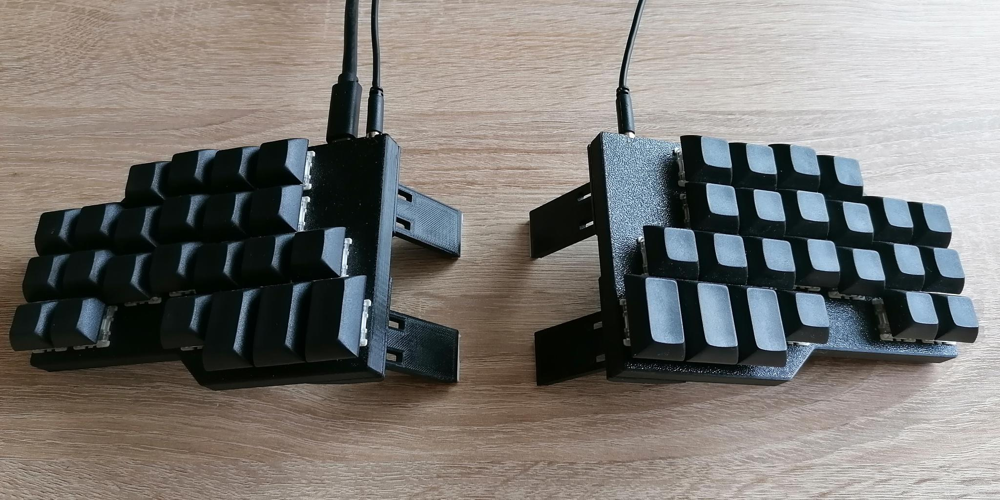

# Ergomin

## Overview
The Ergomin is the second keyboard I have built, following the Manuform. It is a 40% split keyboard inspired by the [ErgoDox](https://www.ergodox.io/) but with a focus on minimal finger movements and compact size.
Like its predecessor and the ErgoDox it features an ergonomic layout with ortholinear (non-staggered) columns. 

The Ergomin is mainly intended as a cheaper and easier to build version of the Manuform that still retains most of the benefits while adding a few of its own.

## Parts list
The Ergomin uses a PCB to keep wiring neat and simple, despite the PCB and its complementary components the following parts are needed:
* 48x keyboard switches (Cherry MX, Gateron, etc.)
* 42x keycaps 1U
* 6x keycaps 1.5U
* 6x countersunk head screws M3x8
* 6x nuts M3
* 6x rubber feet
* 1x TRRS to TRRS cable 30cm (make sure it is the 4-pole variant)
* ~90g of PETG filament for the 3D printed case

## Building the firmware
The firmware is powered by QMK, [install QMK](https://docs.qmk.fm/#/newbs_getting_started) if not already done.
After the installation it is necessary to add a symlink to the qmk/ subfolder of this repository to the QMK keyboards/ directory, for Linux e.g by
```
ln -s /path/to/ergomin/qmk /path/to/qmk/keyboards/ergomin
```

Now you should be able to compile the keyboard firmware by executing
```
qmk compile -kb ergomin -km default
```

Make sure to have a look at the excellent [QMK Documentation](https://docs.qmk.fm/#/newbs_building_firmware) on how to create and customize your own keymap.

## Building the keyboard
### Case
Start by printing the case split into top and bottom pieces. For the top pieces you have to insert the embedded M3 nuts during printing. I recommend using PrusaSlicer for slicing, since the necessary print pause is already configured in the attached 3MF files.

### PCB
The heart of the Ergomin is the PCB. It is designed in such a way that the PCB for the left and right half are the same. 
To assemble the halves, take two PCBs and lay them down with different sides facing up. Now you can solder the complementary SMD components on each half without soldering the keyboard switches yet.
**Important: Only solder the SMD components to the top of each PCB! Otherwise the keyboard will neither work nor fit into the case!** 

### Testing the connections
Now its time for the first tests. Connect the halves with the TRRS cable and connect the Ergomin to your computer. Reset it using the onboard button on the left half and flash the firmware using
```
qmk flash -kb ergomin -km default
```
The Ergomin should be recognized by your OS as a USB keyboard, now you can try to input characters by taking a jumper wire and carefully shorting the pads next to the diodes which are closest to each other.

### Final assembly
Disconnect the keyboard from your computer and remove the TRRS cable.

The halves can now be inserted into their top pieces and the keyboard switches can be inserted from the top. Make sure they click in place and their pins reach through the holes in the PCBs. 
With all switches in place, they can be soldered from the bottom.

The keyboard can now be closed up using the bottom pieces of the case and the M3x8 screws. If the screws aren't flush with the bottom, you can use a countersink bit to enlargen the recesses.
After attaching the keycaps and rubber feet, the build is completed.

## Reflashing the firmware
When flashing e.g. a new keymap to the Ergomin, it has to be put into the bootloader mode. This can be done by hitting a key with the `QK_BOOT` keycode or pressing the reset button as during the build. By default, this `QK_BOOT` keycode can be activated by holding both outermost thumb keys and hitting the key in the lower left corner.

It is highly recommended to always include this `QK_BOOT` keycode in any keymap you create as the physical reset button can't be reached anymore after the switches are soldered.

## Possible modifications

To increase the ergonomics, tenting feet may be added. I modified [these foldable tenting feet](https://www.thingiverse.com/thing:4491679) by increasing their length (to increase the tenting angle) and adding a cutout to still access the screws. Due to the "No Derivatives"-flag in the model license I am unfortunately not able to share my modified version. The modifications can still be done in a few minutes directly in PrusaSlicer and the feet afterwards printed and glued to the bottom of the case.

## License
This project is licensed under the MIT license, see [`LICENSE.txt`](LICENSE.txt) for further information.
