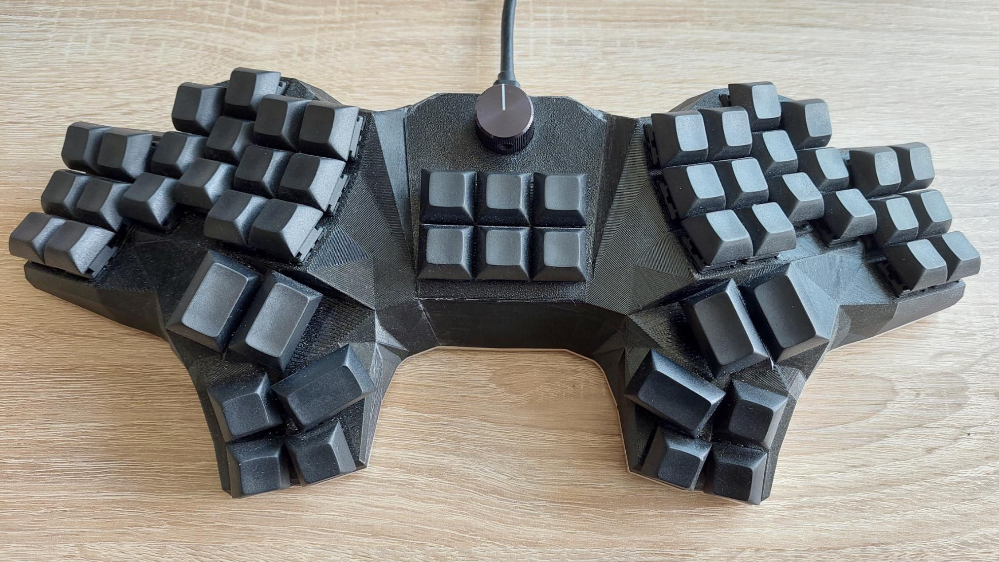

# Manuform

## Overview
The Manuform is the first keyboard I have built. It is a 50% keyboard based on the [ManuForm](https://geekhack.org/index.php?topic=46015.0) by Jeff Gran and is focussed on ergonomic typing with ortholinear (non-staggered) columns and minimal finger movement.
The main differences between the original and this version are:
* hidden screws by using embedded nuts
* aluminum bottom plate for extra rigidity
* 6 extra keys (in my case mapped to quick media access like play/pause, mute, etc.)
* rotary encoder for volume control

## Parts list
* 54 keyboard switches (Cherry MX, Gateron, etc.)
* 48 keycaps 1U
* 6 keycaps 1.5U
* ~300g of PETG filament
* access to a 3D printer
* access to a CNC router or laser cutter (for the bottom plate, I ordered mine online)

## Building the firmware
The firmware is powered by QMK, [install QMK](https://docs.qmk.fm/#/newbs_getting_started) if not already done.
After the installation it is necassary to add a simlink to the qmk/ subfolder of this repository to the QMK keyboards/ directory, for linux e.g by
```
ln -s /path/to/manuform/qmk /path/to/qmk/keyboards/manuform
```

Now you should be able to compile the keyboard firmware by executing
```
qmk compile -kb manuform -km default
```

Make sure to have a look at the excellent [QMK Documentation](https://docs.qmk.fm/#/newbs_building_firmware) on how to create and customize your own keymap.

## License
This project is licensed under the MIT license, see [`LICENSE.txt`](LICENSE.txt) for further information.

