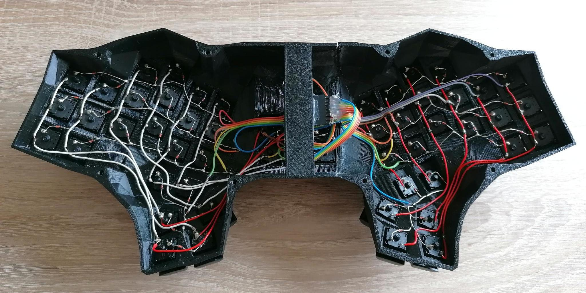

# Manuform

## Overview
The Manuform is the first keyboard I have built. It is a 50% keyboard based on the [ManuForm](https://geekhack.org/index.php?topic=46015.0) by Jeff Gran and is focussed on ergonomic typing with ortholinear (non-staggered) columns and minimal finger movement.
The main differences between the original and this version are:
* hidden screws by using embedded nuts
* aluminum bottom plate for extra rigidity
* 6 extra keys (in my case mapped to quick media access like play/pause, mute, etc.)
* rotary encoder for volume control

If you want to built a custom ergonomic keyboard, I highly recommend to have a look at my other keyboards instead. The Manuform takes a really long time to build (mainly due to the hand-wiring) and the build guide will be incomplete and sparse. It was my first try in building custom keyboards and is mainly included for reference.

## Parts list
* 54x keyboard switches (Cherry MX, Gateron, etc.)
* 48x keycaps 1U
* 6x keycaps 1.5U
* 54x diodes 1N4148
* 1x Arduino Pro Micro
* 1x Micro-USB plug to USB-C jack adapter
* 8x countersunk head screws M3x10
* 8x nuts M3
* 4-8x rubber feet
* ~300g of PETG filament
* access to a CNC router or laser cutter (for the bottom plate, I ordered mine online)

## Building the firmware
The firmware is powered by QMK, [install QMK](https://docs.qmk.fm/#/newbs_getting_started) if not already done.
After the installation it is necessary to add a symlink to the qmk/ subfolder of this repository to the QMK keyboards/ directory, for Linux e.g by
```
ln -s /path/to/manuform/qmk /path/to/qmk/keyboards/manuform
```

Now you should be able to compile the keyboard firmware by executing
```
qmk compile -kb manuform -km default
```

Make sure to have a look at the excellent [QMK Documentation](https://docs.qmk.fm/#/newbs_building_firmware) on how to create and customize your own keymap.

## Building the keyboard
### Case
Start by printing the case split into the left and right half. For both halves you have to insert the embedded M3 nuts during printing. I recommend using PrusaSlicer for slicing, since the necessary print pause is already configured in the attached 3MF files.

### Wiring

For the wiring, have a look at the [hand-wiring guide](https://docs.qmk.fm/#/hand_wire) by QMK. The matrix layout can be found or adjusted in [`qmk/manuform.h`](qmk/manuform.h).
Also, connect the encoder to D2, D3 and GND.

### Closing it up
Cut out/order the bottom plate and use a countersink bit to allow the countersunk screws to sit flush. After screwing on the bottom plate and attaching the rubber feet, the build is completed.

## License
This project is licensed under the MIT license, see [`LICENSE.txt`](LICENSE.txt) for further information.

